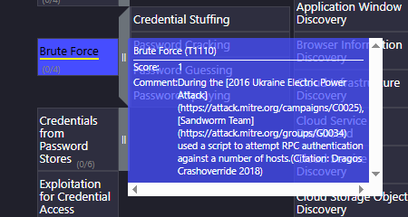
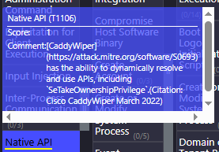

# UFO-1 — Sherlock (HackTheBox)

| | |
|---|---|
| **Platform** | HackTheBox |
| **Type** | Sherlock |
| **Difficulty** | Very Easy |
| **Category** | Threat Intelligence / OSINT |
| **Main Tool** | MITRE ATT&CK |

---

## Scenario

As a Threat Intelligence intern in an ICS sector organization, our manager has asked us to research the **Sandworm Team** (also known as BlackEnergy Group and APT44) using the MITRE ATT&CK framework, in order to map their behaviors and tactics.

---

## Methodology

All answers were found via the MITRE ATT&CK page for the Sandworm Team:
👉 https://attack.mitre.org/groups/G0034/

The approach for each task:
1. Consult the group's profile on MITRE ATT&CK
2. Read the references cited at the bottom of the page for historical details
3. Explore the associated techniques and documented campaigns

---

## Resolution

### Task 1
**Question:** According to the sources cited by Mitre, in what year did the Sandworm Team begin operations?

By checking the sources cited by MITRE for the G0034 group, the references mention that Sandworm Team began its operations as early as **2009**.

**Answer: `2009`**

---

### Task 2
**Question:** Mitre notes two credential access techniques used by the BlackEnergy group during a 2016 campaign against the Ukrainian electric power grid. One is LSASS Memory access (T1003.001). What is the Attack ID for the other?

To find this information efficiently, I used the **ATT&CK Navigator** tool provided by MITRE, which visually maps an adversary's techniques. Here is the methodology:

1. On the Sandworm Team (G0034) page, I scrolled down to the "Techniques Used" section. I clicked on the **ATT&CK Navigator Layers** dropdown menu and selected **view** under the Enterprise Layer.

2. This opened the interactive matrix showing all techniques used by the group. I navigated to the **Credential Access** tactic column and spotted the highlighted techniques.

3. By hovering over the **Brute Force** block, the tooltip displayed the exact Attack ID (**T1110**) and the comment confirmed it was specifically used during the 2016 Ukraine Electric Power Attack via an RPC authentication script.

*(Note: This information can also be cross-referenced directly in the MITRE tables for Campaign C0025).*

**Answer: `T1110`**

### Task 3
**Question:** During the 2016 campaign, the adversary was observed using a VBS script. What is the name of the VBS file?

While researching the specifics of the 2016 Ukraine Electric Power Attack, the exact name of the VBS script wasn't immediately prominent on the main group page. To find it, I conducted targeted OSINT (Open-Source Intelligence) research, focusing on the campaign's lateral movement tools. By digging into detailed threat intelligence documentation regarding the incident, I discovered that the Sandworm Team utilized a specific script to facilitate the transfer of ICS-specific payloads across targeted systems.

As highlighted in the documentation below, the script in question is named **ufn.vbs**.

**Answer: `ufn.vbs`**
---

### Task 4
**Question:** The APT conducted a major campaign in 2022. The server application was abused to maintain persistence. What is the Mitre Att&ck ID for the persistence technique?

To identify the exact MITRE ATT&CK ID, I followed a similar methodology using the MITRE documentation and the interactive matrix:

1. First, I identified the major 2022 campaign on the Sandworm group page, which is tracked as the **2022 Ukraine Electric Power Attack (C0034)**.

2. Just like before, I opened the **ATT&CK Navigator** (Enterprise Layer) to visualize the group's exact operational footprint.

3. The question mentions a "persistence technique" abusing a "server application". I went directly to the **Persistence** tactic column in the matrix, expanded the **Server Software Component** category, and spotted the **Web Shell** sub-technique.

4. Hovering over the "Web Shell" block provided the final confirmation. The tooltip displays the exact ID **T1505.003** and explicitly states that during the 2022 Ukraine Electric Power Attack, the group deployed a webshell on an internet-facing server.

*(Fun fact: As seen in the tooltip above, this step actually gave away the answer to the next task!)*

**Answer: `T1505.003`** (Server Software Component: Web Shell)

---

### Task 5
**Question:** What is the name of the malware / tool used in question 4?

I really struggled with this specific task, as the exact name wasn't immediately obvious to me on the main MITRE page. After conducting some external internet research (OSINT) based on the 2022 campaign details, I found the answer. The tool used to deploy the web shell and maintain persistent access is Neo-reGeorg, an HTTP/HTTPS tunnel based on reGeorg.

**Answer: 'Neo-reGeorg'**

### Task 6
**Question:** Which SCADA application binary was abused by the group to achieve code execution on SCADA Systems in the same campaign in 2022?

To solve this task, I followed the specific hint provided by the challenge prompt, which directed me to the bottom of the use case table on the campaign page.

1. I navigated back to the MITRE campaign page for the **2022 Ukraine Electric Power Attack (C0034)**.
2. I scrolled down to the "Techniques Used" table and focused on the last few entries, which are specifically categorized under the **ICS** (Industrial Control Systems) domain.
3. By reading through the descriptions, I found the entry for the **Scripting (T0853)** technique. The documentation explicitly details the execution flow: the group used a VBS script (`lun.vbs`) to run a batch file (`n.bat`), which ultimately executed the legitimate MicroSCADA binary **`scilc.exe`** to achieve malicious code execution.

**Answer: `scilc.exe`**

### Task 7
**Question:** Identify the full command line associated with the execution of the tool from question 6.

To find the exact command line used to execute `scilc.exe`, I needed to dig deeper than the high-level summaries on the MITRE page and consult the primary source reports. Here is the methodology:

1.  First, I looked for techniques related to command execution. On the main MITRE page for the group, under the ICS domain, I found technique **T0807 (Command-Line Interface)**. The description confirmed that Sandworm leveraged the SCIL-API to execute commands through the `scilc.exe` binary.
    

2.  Next, I navigated to the dedicated page for the **Command-Line Interface (T0807)** technique itself. In the "Procedure Examples" section, under the entry for the 2022 Ukraine Electric Power Attack (C0034), there was a citation link `[3]` pointing to the external threat intelligence report that documented this specific behavior.
    

3.  Clicking citation `[3]` took me to a detailed Google Cloud (Mandiant) Threat Intelligence blog post analyzing the disruption. By searching the page for "scilc.exe", I located the exact section analyzing the command syntax. The report provided the full command fragment used by the attackers.
    

**Answer:**

C:\sc\prog\exec\scilc.exe -do pack\scil\s1.txt

### Task 8
**Question:** What malware/tool was used to carry out data destruction in a compromised environment during the same campaign?

Since this question refers to the same 2022 campaign, I stayed on the detailed Google Cloud (Mandiant) Threat Intelligence report I found in the previous task. Here is how I located the exact malware:

1. In Threat Intelligence, "data destruction" is practically synonymous with "wiper" malware, especially when dealing with the Sandworm Team.
2. I used the browser's find function (`Ctrl + F`) to search for the keyword "wipe" within the report.
3. This search immediately led me to a comprehensive table detailing the files and tools associated with the attack. The table explicitly lists **CADDYWIPER** (executed via `msserver.exe / lhh.exe`) as the tool used for this destructive phase.

**Answer: `CaddyWiper`**
---

### Task 9
**Question:** What is the Mitre Att&ck ID of the specific technique CaddyWiper could perform in the Execution tactic?

To answer this, I needed to shift my focus from the general Sandworm Team page to the specific capabilities of the CaddyWiper malware identified in the previous task. Here is the methodology:

1. I used the search bar on the MITRE ATT&CK portal to find the dedicated software page for **CaddyWiper (S0693)**.

2. Just like analyzing an APT group, MITRE provides an interactive matrix for specific software. I clicked on **ATT&CK Navigator Layers** and selected **view** for the Enterprise Layer to map out CaddyWiper's capabilities.

3. The question explicitly asked for a technique under the **Execution** tactic. I navigated to the Execution column in the matrix and spotted the highlighted technique: **Native API**.

4. By hovering over the "Native API" block, the tooltip revealed the specific ID **T1106**. The comment confirms that CaddyWiper has the ability to dynamically resolve and use Windows APIs (such as `SeTakeOwnershipPrivilege`) to carry out its execution.

**Answer: `T1106`** (Native API)

---

### Task 10
**Question:** They are associated with an auto-spreading malware that acted as a ransomware while having worm-like features. What is the name of this malware?

I didn't know the exact name of this specific malware off the top of my head, so I relied on a targeted web search using the clues provided in the prompt. By searching for keywords like `Sandworm "auto-spreading" ransomware "worm-like"`, the results immediately pointed to **NotPetya**, deployed in 2017. Disguised as ransomware, NotPetya was actually a wiper with self-spreading capabilities across the network, causing billions of dollars in global damage.

**Answer: `NotPetya`**

---
### Task 11
**Question:** What was the Microsoft security bulletin ID for the vulnerability that NotPetya used to spread?

To find the exact bulletin ID, I used the hint provided by the platform combined with a quick web search:

1. The HackTheBox hint explicitly suggested researching the "ETERNAL exploits". Knowing from historical threat intel that NotPetya heavily relied on the infamous **EternalBlue** exploit to propagate as a worm across networks, I had my primary keyword.

2. I performed a straightforward web search querying `microsoft security bulletin id eternal blue`. The top results immediately provided the historical context, confirming that the critical SMBv1 vulnerability was patched under the Microsoft security bulletin released in March 2017.

**Answer: `MS17-010`**
---

### Task 12
**Question:** What is the name of the malware/tool used by the group to target modems?

To find the name of this specific tool, I followed the detailed hint provided by the challenge, which directed me to the "References" section at the bottom of the MITRE group page. Here is the methodology:

1. The challenge hint explicitly instructed me to look through the research papers and blogs listed in the references to find a resource detailing a tool targeting modems.

2. I scrolled down to the bottom of the MITRE page for the Sandworm Team. Using the browser's find function (`Ctrl + F`), I searched for the keyword "modem" within the extensive list of references. This quickly highlighted reference `[46]`, a report from SentinelOne titled "AcidRain | A Modem Wiper Rains Down on Europe".

3. The title of the referenced report itself gave away the answer. To be thorough, checking the actual source report confirms that **AcidRain** is the specific wiper malware deployed by the group to target satellite modems (Viasat) at the onset of the 2022 invasion.

**Answer: `AcidRain`**

### Task 13
**Question:** On which port did the Sandworm team reportedly establish their SSH server for listening?

The platform provided a hint suggesting to open the ATT&CK Navigator (Enterprise Layer), locate the "Command and Control" tactic, and hover over the "Non-Standard Port" technique to read the use case.

However, I opted for a slightly faster method. Since all the techniques mapped to the adversary are already listed in the large "Techniques Used" table on the main Sandworm Team profile page, I didn't necessarily need to load the Navigator matrix.

1. I stayed on the main MITRE page for Sandworm Team (G0034).
2. I simply used the browser's find function (`Ctrl + F`) and searched for the exact technique name provided in the hint: **"Non-Standard Port"**.
3. This took me directly to technique **T1571**. Reading the associated description in the table, it clearly states that the Sandworm Team has used port **6789** to accept connections on their SSH server, avoiding the standard port 22 to evade detection.

**Answer: `6789`**
---
### Task 14
**Question:** The Sandworm Team has been assisted by another APT group on various operations. Which specific group is known to have collaborated with them?

To identify this specific partnership, I conducted targeted Open-Source Intelligence (OSINT) research. By querying threat intelligence vendor reports and security databases using advanced search operators (e.g., `"Sandworm Team" AND ("assisted by" OR "collaborated with") AND APT`), the findings consistently pointed to **APT28** (also tracked as Fancy Bear or Sofacy). Both groups are known to operate under the umbrella of Russia's GRU and have a documented history of coordinating on major cyber campaigns.

**Answer: `APT28`**

---

## What I Learned

- MITRE ATT&CK is a central resource in Threat Intelligence: a single group page centralizes campaigns, techniques, tools, and references.
- Sandworm is one of the most active APT groups in the ICS/SCADA sector, possessing both destructive capabilities (wipers) and espionage functions.
- The Threat Intel methodology consists of mapping an adversary's TTPs (Tactics, Techniques, and Procedures) to anticipate their future actions.

---

*Write-up written as part of the UFO-1 Sherlock on HackTheBox.*