# UFO-1 — Sherlock (HackTheBox)

| | |
|---|---|
| **Platform** | HackTheBox |
| **Type** | Sherlock |
| **Difficulty** | Very Easy |
| **Category** | Threat Intelligence / OSINT |
| **Main Tool** | MITRE ATT&CK |

---

## Scenario

As a Threat Intelligence intern in an ICS sector organization, our manager has asked us to research the **Sandworm Team** (also known as BlackEnergy Group and APT44) using the MITRE ATT&CK framework, in order to map their behaviors and tactics.

---

## Methodology

All answers were found via the MITRE ATT&CK page for the Sandworm Team:
👉 https://attack.mitre.org/groups/G0034/

The approach for each task:
1. Consult the group's profile on MITRE ATT&CK
2. Read the references cited at the bottom of the page for historical details
3. Explore the associated techniques and documented campaigns

---

## Resolution

### Task 1
**Question:** According to the sources cited by Mitre, in what year did the Sandworm Team begin operations?

By checking the sources cited by MITRE for the G0034 group, the references mention that Sandworm Team began its operations as early as **2009**.

**Answer: `2009`**

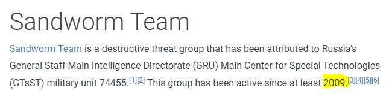

---

### Task 2
**Question:** Mitre notes two credential access techniques used by the BlackEnergy group during a 2016 campaign against the Ukrainian electric power grid. One is LSASS Memory access (T1003.001). What is the Attack ID for the other?

In the Credential Access section of the 2016 campaign against the Ukrainian power grid, MITRE documents a second technique: **Brute Force** (repeated login attempts across several hosts on the compromised network).

**Answer: `T1110`**

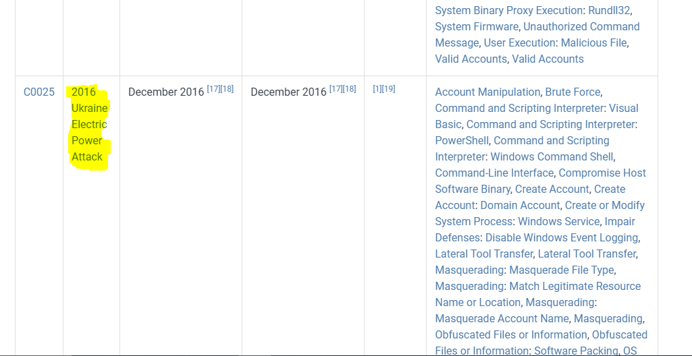
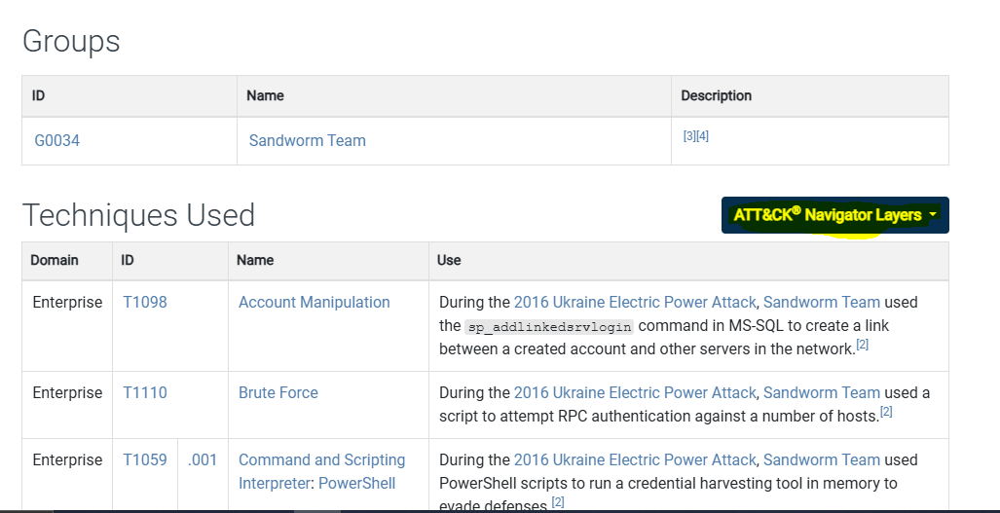
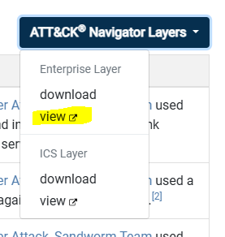
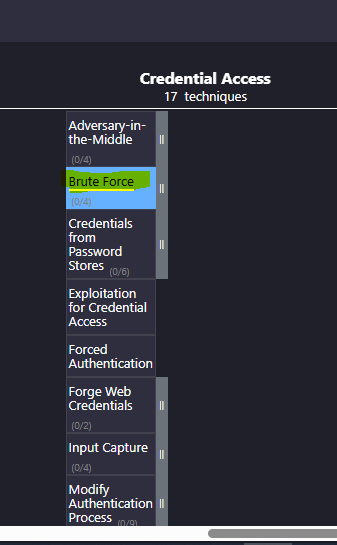

---

### Task 3
**Question:** During the 2016 campaign, the adversary was observed using a VBS script. What is the name of the VBS file?

The 2016 campaign documents the use of a VBS script to automate certain actions on the compromised systems.

**Answer: `ufn.vbs`**

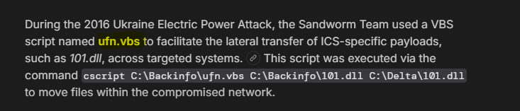

---

### Task 4
**Question:** The APT conducted a major campaign in 2022. The server application was abused to maintain persistence. What is the Mitre Att&ck ID for the persistence technique?

During the 2022 campaign, the group abused a web server application to drop a **Web Shell**, allowing for persistent remote access.

**Answer: `T1505.003`** (Server Software Component: Web Shell)

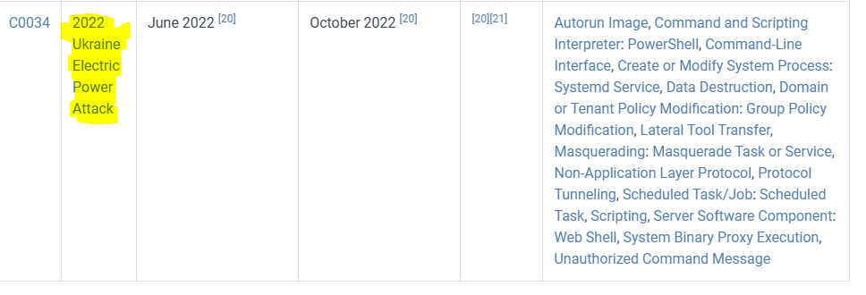
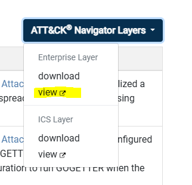
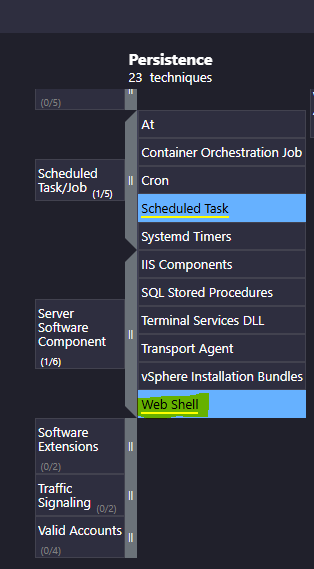
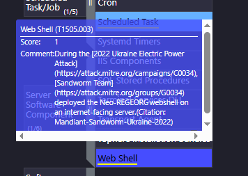

---

### Task 5
**Question:** What is the name of the malware / tool used in question 4?

I really struggled with this specific task, as the exact name wasn't immediately obvious to me on the main MITRE page. After conducting some external internet research (OSINT) based on the 2022 campaign details, I found the answer. The tool used to deploy the web shell and maintain persistent access is Neo-reGeorg, an HTTP/HTTPS tunnel based on reGeorg.

**Answer: 'Neo-reGeorg'**

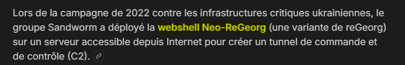

### Task 6
**Question:** Which SCADA application binary was abused by the group to achieve code execution on SCADA Systems in the same campaign in 2022?

In the 2022 campaign targeting ICS/SCADA systems, the group abused a legitimate binary from the SCADA application to execute malicious code.

**Answer: `scilc.exe`**

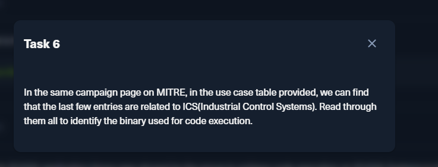
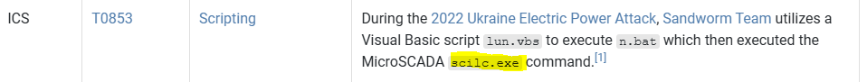

---

### Task 7
**Question:** Identify the full command line associated with the execution of the tool from question 6.

The full command line documented in MITRE for the execution of `scilc.exe` against the substations:

**Answer:**

C:\sc\prog\exec\scilc.exe -do pack\scil\s1.txt

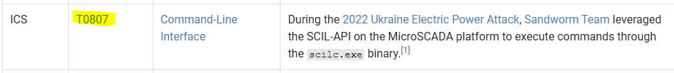
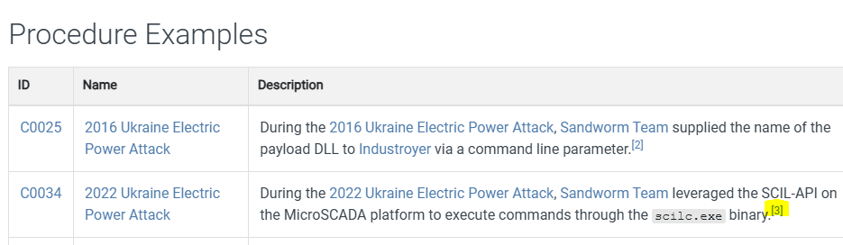
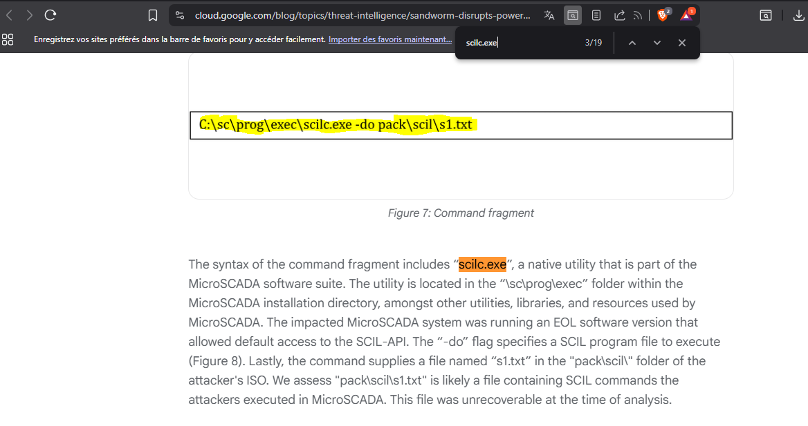

---

### Task 8
**Question:** What malware/tool was used to carry out data destruction in a compromised environment during the same campaign?

For data destruction, the group deployed **CaddyWiper**, a wiper malware designed to overwrite data and render systems unusable.

**Answer: `CaddyWiper`**

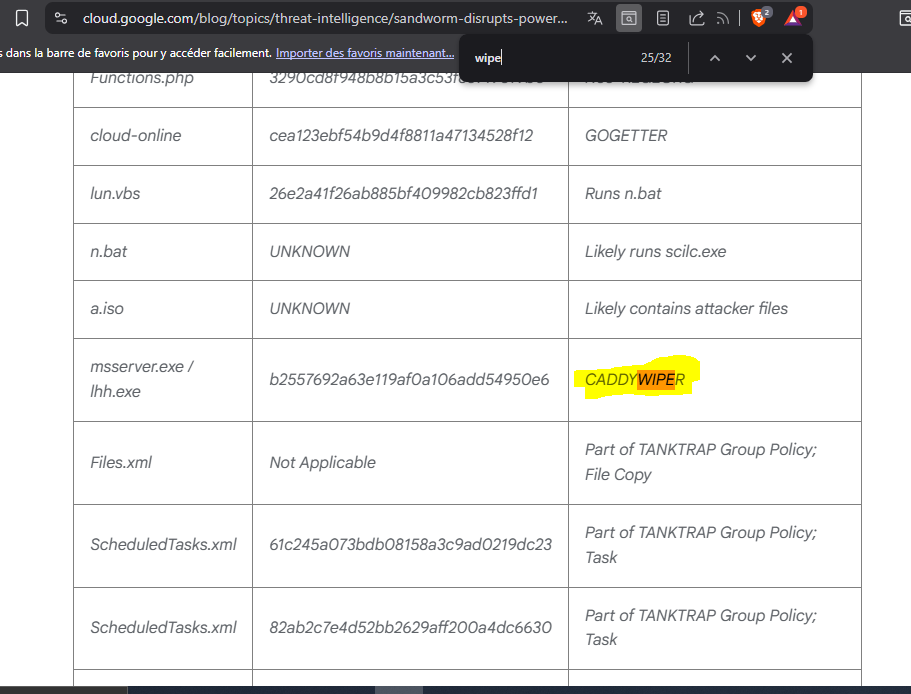

---

### Task 9
**Question:** What is the Mitre Att&ck ID of the specific technique CaddyWiper could perform in the Execution tactic?

In addition to its destructive capabilities, CaddyWiper can interact directly with native Windows APIs to execute code — a technique documented under the ID **T1106**.

**Answer: `T1106`** (Native API)

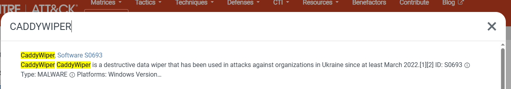
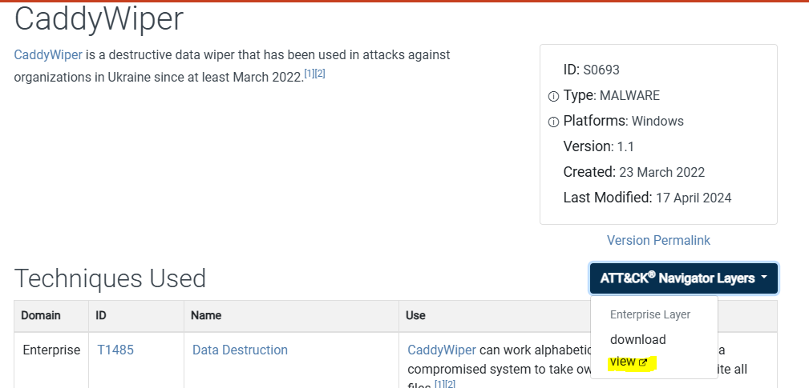
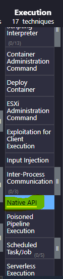

---

### Task 10
**Question:** They are associated with an auto-spreading malware that acted as a ransomware while having worm-like features. What is the name of this malware?

I didn't know the exact name of this specific malware off the top of my head, so I relied on a targeted web search using the clues provided in the prompt. By searching for keywords like `Sandworm "auto-spreading" ransomware "worm-like"`, the results immediately pointed to **NotPetya**, deployed in 2017. Disguised as ransomware, NotPetya was actually a wiper with self-spreading capabilities across the network, causing billions of dollars in global damage.

**Answer: `NotPetya`**

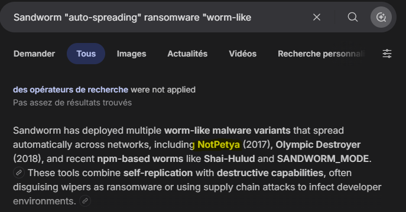

---

### Task 11
**Question:** What was the Microsoft security bulletin ID for the vulnerability that NotPetya used to spread?

NotPetya exploited the **EternalBlue** vulnerability in the SMBv1 protocol, covered by the Microsoft security bulletin **MS17-010**.

**Answer: `MS17-010`**

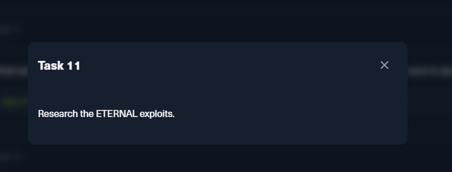
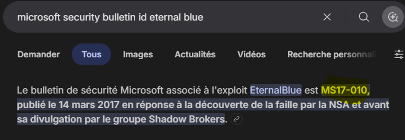

---

### Task 12
**Question:** What is the name of the malware/tool used by the group to target modems?

To target satellite modems (notably at the beginning of the war in Ukraine in 2022), Sandworm used **AcidRain**, a wiper specifically designed for embedded network equipment.

**Answer: `AcidRain`**

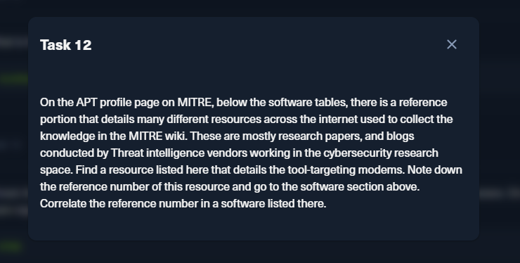
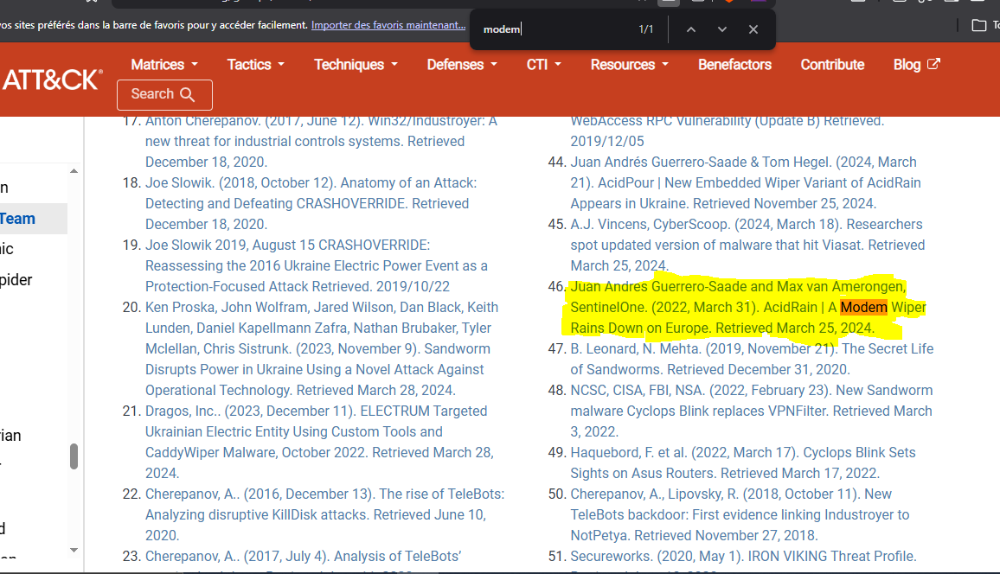
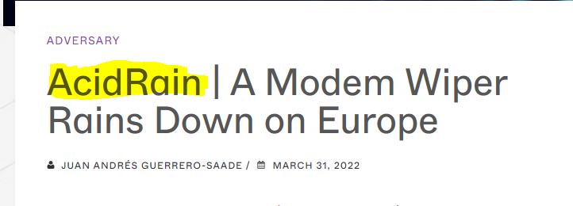

---

### Task 13
**Question:** On which port did the Sandworm team reportedly establish their SSH server for listening?

To avoid detection on the standard SSH port (22), Sandworm configured its SSH servers on a non-standard port.

**Answer: `6789`**

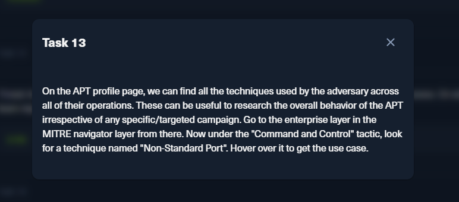
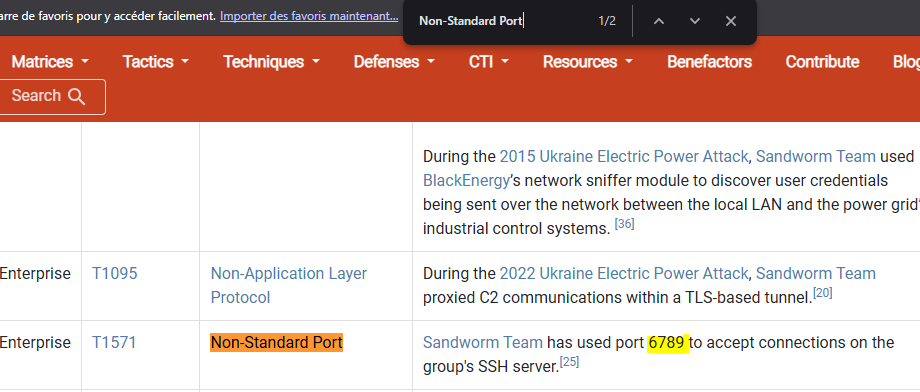

---
### Task 14
**Question:** The Sandworm Team has been assisted by another APT group on various operations. Which specific group is known to have collaborated with them?

To identify this specific partnership, I conducted targeted Open-Source Intelligence (OSINT) research. By querying threat intelligence vendor reports and security databases using advanced search operators (e.g., `"Sandworm Team" AND ("assisted by" OR "collaborated with") AND APT`), the findings consistently pointed to **APT28** (also tracked as Fancy Bear or Sofacy). Both groups are known to operate under the umbrella of Russia's GRU and have a documented history of coordinating on major cyber campaigns.

**Answer: `APT28`**

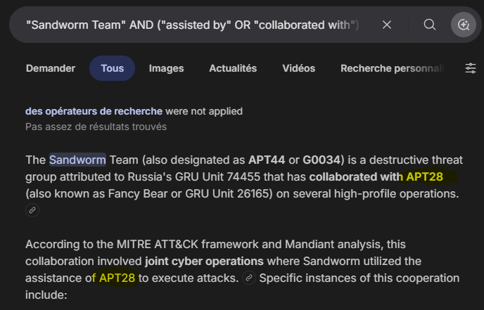

---

## What I Learned

- MITRE ATT&CK is a central resource in Threat Intelligence: a single group page centralizes campaigns, techniques, tools, and references.
- Sandworm is one of the most active APT groups in the ICS/SCADA sector, possessing both destructive capabilities (wipers) and espionage functions.
- The Threat Intel methodology consists of mapping an adversary's TTPs (Tactics, Techniques, and Procedures) to anticipate their future actions.

---

*Write-up written as part of the UFO-1 Sherlock on HackTheBox.*